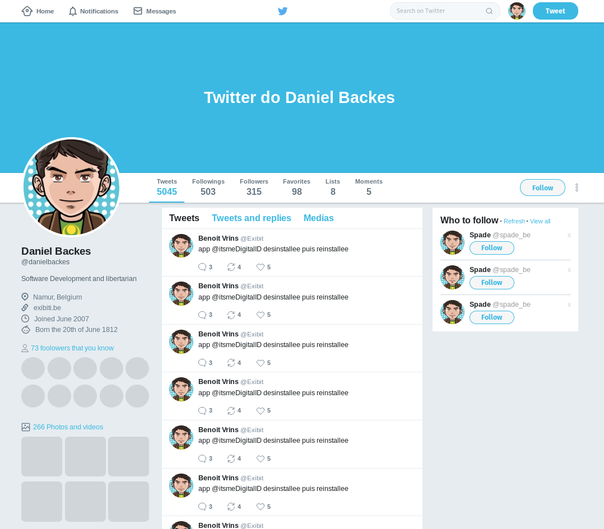

# Twitter Clone

HTML and CSS project developed copying the instructor coding during the Rocketseat Bootcamp bonus course, to learn CSS Flexbox concepts.

## What I learned in this project?

- How organize element in HTML usign CSS Flexbox
- Some news selectors like ::after and :frist-child

## See the result

